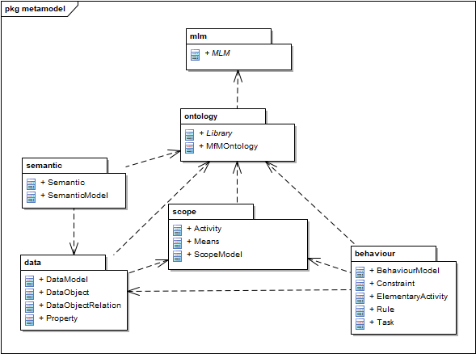
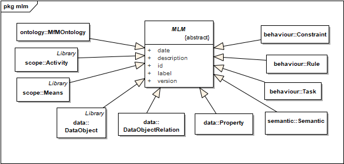

# Metamodel
Metamodel for the Model for Manufacturing (MfM) methodology.

- All classes inherit from the AbstractMLMAtributes class in the 'mfm' (model lifecycle management) package, which contains a series of attributes for managing the model lifecycle.

- Classes are divided into 'semantic' , 'scope', 'data' and 'behavior' packages.
- Some classes have relationships with themselves: Activity, Means, DataObject, ActivityDataRelation, Task. To model these relationships, abstract classes ('interface') have been used that generalize the previous ones: AbstractActivity, AbstractMeans, AbstractDataObject, AbstractActivityDataRelation, AbstractTask.

### Metamodel: Semantic Model

- In this preliminary approach, the Semantic Model has been modelled just as 3 common attributes 'name', 'shortName' and 'description' for all classes in 'scope', 'data' and 'behaviour' packages.
- The idea behind this solution is based on having a detailed description of all the ontology concepts for the future construction of interfaces without doubts about semantics.
- The 3 attributes are defined in the class AbstractSemanticAttributes which is inherited by the rest of classes.

### Metamodel: Scope Model

- The root class is ScopeModel, which is composed of a main 'rootActivity' (class Activity).
- The important concepts of the Scope Model are the activities (Activity), the resources or means for their realization (Means) and the objects required and produced by the activity (DataObject, modeled in the data package), as well as the relationships between them.
- Activities are modeled with the AbstractActivity and Activity classes, where the first is an abstract generalization of the second.
- The sequence of activities is modeled by the relationship between AbstractActivity and Activity, through the roles 'prevActivity' and 'nextActivity'.
- An Activity can be a ComposedActivity (which is decomposed into other subactivities, with 'activityParent' and 'activityChild' roles) or an ElementalActivity (without children). The latter is used in the 'behavior' package.
- The resources to carry out the activities are modeled with the AbstractMeans and Means classes.
- Sometimes, the resources that are used in sub-activities can be packaged in a single resource, easier to associate with the parent activity (for example, “CAX” to package “CAD”, “CAD / CAM” and “CAPP” systems) . This possibility has been modeled with the aggregation relationship between Means ('bundledMeans' role) and AbstractMeans ('means' role).
- The data objects to be used in the activities are modeled with the AbstractDataObject and DataObject classes. (Note: these classes are valid in IDEF0 for inputs, outputs and controllers.)
- Similar to resources, data objects can be related to each other by aggregation relationships ('dataObjectParent' and 'dataObjectChild' roles).
- The relationship between Activity and Means is simple and direct.
- Instead, the relationship between Activity and DataObject is more complex and has been modeled through the ActivityDataRelation class, which inherits from AbstractActivityDataRelation (it is also used in the 'behavior' package).
- AbstractActivityDataRelation has two boolean attributes: 'dataRequired' (true for IDEF0 inputs and controllers) and 'dataProduced' (true for outputs).

### Metamodel: Data Model

- The root class is DataModel, which is composed of one or more DataObject.
- The important concepts of the Data Model are the data objects and their properties, as well as the relationships between them.
- Property has two attributes of type string ('dataType', 'value') for primitive data types like (integer, 8) or (float, 8.0) or for classes and objects like (Material, AA7075).
- Data objects can be related to each other through the DataObjectRelation class, which is used to specify what type of relationship exists between both objects.

### Metamodel: Behaviour Model

- The root class is BehaviorModel, which is composed of all the ElementalActivity defined in the Scope Model.
- The important concepts of the Behavior Model are the tasks that allow an elementary activity to be carried out, the rules associated with the tasks and their possible constraints and the data objects required or produced, as well as the relationships between them.
- An ElementalActivity (from the 'scope' package) adds at least one Task.
- Each Means of the ElementalActivity (see 'scope' package) can be assigned to several Tasks.
- Tasks are modeled with the AbstractTask and Task classes.
- Two tasks can be performed consecutively ('prevTask' and 'nextTask' roles).
- The procedure to perform a Task is modeled with the Rule class. Each Task has its Rule.
- All the data objects associated with the ElementalActivity (see 'scope' package) are now assigned to the Tasks. It can be done in two ways.
- The first way is identical to how it is done with the ActivityDataRelation class (see 'scope' package), substituting the ElementalActivity for the Task. This form simply specifies which task in the elementary activity each data object uses.
- The second way is by using the TaskDataRelation class to relate the Task to a Property of the data object. This form adds more information than the previous one.
- The two classes ActivityDataRelation and TaskDataRelation inherit the 'dataRequired' and 'dataProduced' attributes from the AbstractActivityDataRelation class.
- A Rule can have several Constraint.
- A Constraint is associated with a Property of a data object.

### Metamodel: overview

