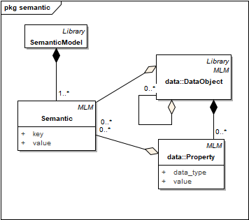
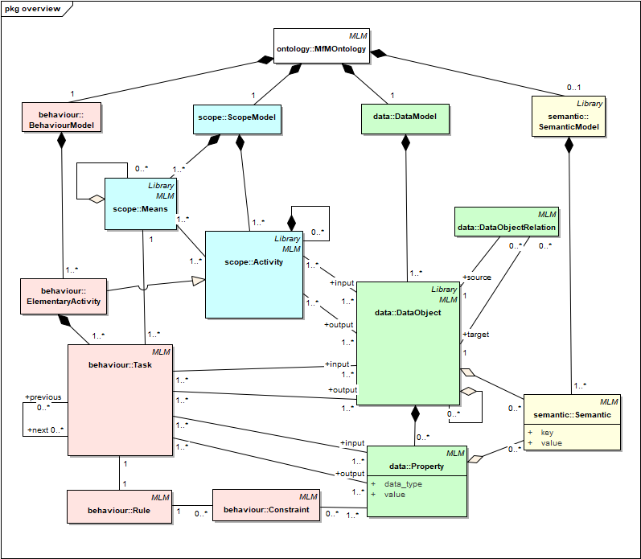

# Metamodel
Metamodel for the Model for Manufacturing (MfM) methodology.

- All classes inherit from the `AbstractMLMAtributes` class in the `mfm` (model lifecycle management) package, which contains a series of attributes for managing the model lifecycle.

- Classes are divided into `semantic` , `scope`, `data` and `behavior` packages.
- Some classes have relationships with themselves: `Activity`, `Means`, `DataObject`, `Task`.

### Metamodel: Semantic Model

- In this preliminary approach, the Semantic Model has been modelled just as a common `description` attribute for `DataObject` and `Property` classes in `scope` package.
- The idea behind this solution is based on having a detailed description of ontology concepts related to the Data model for the future construction of interfaces without doubts about semantics.
- The `description` attribute is defined in the `AbstractSemanticAttributes` class which is inherited by `DataObject` and `Property` classes.

### Metamodel: Scope Model

- The root class is `ScopeModel`, which is composed of a main `root` activity.
- The important concepts of the Scope Model are the activities (`Activity`), the resources or means for their realization (`Means`) and the objects required and produced by the activity (`DataObject`, modelled in the data package), as well as the relationships between them.
- The sequence of activities is modelled by the relationship between Activity objects, through the roles `previous` and `next`.
- An activity can be a `ComposedActivity` (which is decomposed into other subactivities, with `parent` and `child` roles) or an `ElementalActivity` (without children). The latter is used in the `behavior` package.
- The resources to carry out the activities are modelled with the `Means` class.
- Sometimes, the resources that are used in sub-activities can be packaged in a single resource, easier to associate with the parent activity (for example, “CAX” to package “CAD”, “CAD / CAM” and “CAPP” systems) . This possibility has been modelled with the aggregation relationship between `Means` (`bundle` role).
- The data objects to be used in the activities are modelled with DataObject class. (Note: these classes are valid in IDEF0 for inputs, outputs and controllers.)
- Similar to resources, data objects can be related to each other by aggregation relationships (`parent` and `child` roles).
- The relationship between `Activity` and `Means` is simple and direct.
- The relationship between `Activity` and `DataObject` can be `input` (for IDEF0 inputs and controllers) and `output` (for IDEF0 outputs).

### Metamodel: Data Model

- The root class is `DataModel`, which is composed of one or more `DataObject`.
- The important concepts of the Data Model are the data objects and their properties, as well as the relationships between them.
- `Property` has two attributes of type string (`dataType`, `value`) for primitive data types like (integer, 8) or (float, 8.0) or for classes and objects like (Material, AA7075).
- Data objects can be related to each other through the `related` role, which is used to specify what type of relationship exists between both objects.

### Metamodel: Behaviour Model

- The root class is `BehaviorModel`, which is composed of all the `ElementalActivity` defined in the Scope Model.
- The important concepts of the Behavior Model are the tasks that allow an elementary activity to be carried out, the rules associated with the tasks and their possible constraints and the data objects required or produced, as well as the relationships between them.
- An `ElementalActivity` (from the `scope` package) adds at least one Task.
- Each `Means` of the `ElementalActivity` (see `scope` package) can be assigned to several `Tasks`.
- Tasks can be performed consecutively (`previous` and `next` roles).
- The procedure to perform a task is modelled with the `Rule` class. Each task has its rule.
- All the data objects associated with the `ElementalActivity` (see `scope` package) are now assigned to the tasks. It can be done in two ways.
- The first way is identical to how it is done with the `Activity`-`DataObject` relation (see `scope` package), substituting the `ElementalActivity` for the `Task`. This form simply specifies which task in the elementary activity each data object uses.
- The second way consists in relating the `Task` to a `Property` of the data object. This form adds more information than the previous one.
- A `Rule` can have several `Constraints`.
- A `Constraint` is associated with a `Property` of a data object.

### Metamodel: overview

