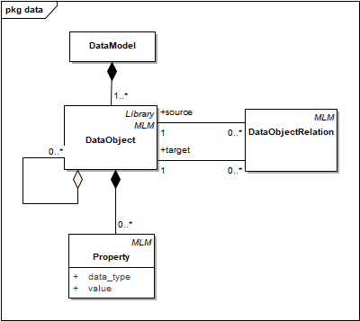
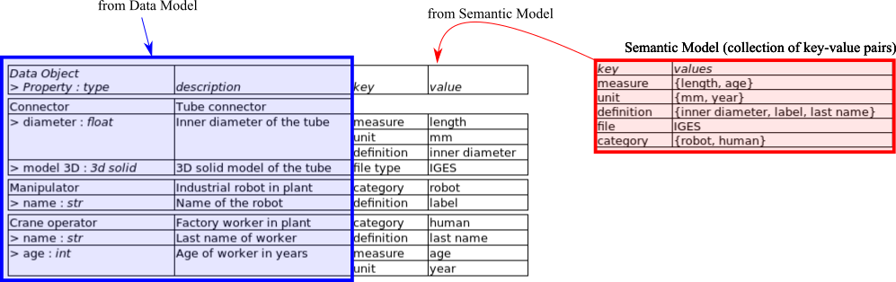
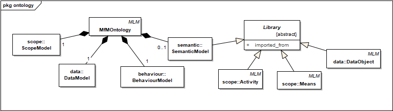

# MfM Metamodel
Metamodel for Model for Manufacturing (MfM) methodology.

## Main package: `metamodel`

All MfM Metamodel classes are arranged into 6 packages:

## Scope Model: package `scope`

- The root class is `ScopeModel`, which is composed of all the activities and all the resources or means necessary to carry out the activities.
- The important concepts of the Scope Model are the activities (`Activity`), the resources or means (`Means`) and the objects required and produced by the activity (`DataObject` from the `data` package), as well as the relationships between them.
- An activity can be decomposed into other subactivities or can be an `ElementaryActivity` (without children). The latter is defined later in the `behaviour` package.
- The Scope Model does not define the sequence of activities. This flow can be inferred in the Behaviour Model (`behaviour` package), from the decomposition of elementary activities into tasks.
- Sometimes, the resources that are used in sub-activities can be packaged in a single resource, easier to associate with the parent activity (for example, “CAX” to package “CAD”, “CAD/CAM” and “CAPP” systems) . This possibility has been modelled with the aggregation relationship between `Means`.
- The data objects to be used by the activities are modelled with `DataObject` class. (Note: these classes are valid in IDEF0 for inputs, outputs and controllers.)
- Similar to resources, data objects can be related to each other by aggregation relationships.
- An `Activity` can require several `Means`. A `Means` can be used by several `Activity`.
- An `Activity` can require several `DataObject` as `input` and `output`. A `DataObject` can be used by several `Activity`.

## Data Model: package `data`

- The root class is `DataModel`, which is composed of all the `DataObject`.
- The important concepts of the Data Model are the data objects and their properties, as well as the relationships between them.
- `Property` has two attributes (`data_type`, `value`) for primitive data types like (integer, 8) or (float, 8.0) or for classes and objects like (Material, AA7075).
- Data objects can be related to each other through the DataObjectRelation class, which is used to specify what type of relationship exists between both objects.

## Behaviour Model: package `behaviour`

- The root class is `BehaviourModel`, which is composed of all the `ElementaryActivity` activities (see Scope Model).
- The important concepts of the Behaviour Model are the tasks that allow an elementary activity to be carried out, the rules associated with the tasks and their possible constraints and the data objects required or produced, as well as the relationships between them.
- An `ElementaryActivity` requires at least one Task.
- Each `Means` of the `ElementaryActivity` (see `scope` package) can be now assigned to several `Task`. A `Task` is carried out by a `Means`.
- The sequence of tasks is defined by the roles `previous` and `next`.
- The procedure to perform a task is modelled with the `Rule` class. Each task has its rule.
- All `DataObject` (see `scope` package) associated with the `ElementaryActivity` are now assigned to the tasks. It can be done in two ways:
    - The first way is identical to how it is done with the `Activity`-`DataObject` relation (see `scope` package), substituting the `ElementaryActivity` for the `Task`. This form simply specifies which task of the elementary activity each data object uses.
    - The second way consists in relating the `Task` to specific `Property` of the data object. This form adds more information than the previous one.
- A `Rule` can have several `Constraints`.
- A `Constraint` is associated with a `Property` of a data object.

## Semantic Model: package `semantic`

- The Semantic Model has been modelled just as common attributes for `DataObject` and `Property` classes in `scope` package.
- The idea behind this solution is based on having a detailed description of ontology concepts related to the Data model for the future construction of interfaces without doubts about semantics.
- Attributes are defined in the `SemanticAttributes` class which are aggregated by `DataObject` and `Property` classes.

This is an example of Semantic Model and its relation with the Data Model:

## Package `ontology`

- The root class `MfMOntology` is the container for the 4 models (Scope, Data, Behaviour, Semantic). Semantic Model is the only one whose definition is optional.
- On the other hand, `Library` represents an exported/imported part to/from another MfM model. It can be:
    + An 'Activity' along with the full structure of its child activities, all the associated `Means`, the related data structure and the definition of its behaviour.
    + A `Means` collection.
    + A `DataObject` structure.
    + A `SemanticModel` as a collection of `SemanticAttributes`.

The following figure shows in more detail the different structures/collections that can be exported/imported as a `Library`:

## Model Lifecycle Management (MLM): package `mlm`

- `MLMAttributes` is an abstract class that defines a series of common attributes for managing the lifecycle of a MfM ontology.

## Overview

